## _Foothold Finder_  

A script inspired by the processes to pwn Hack the Box's Starting Point machines.

# foothold_finder.sh
The script will scan and enumerate open ports on target machine. Highlight if SMB, MS SQL, FTP, or HTTP servers are online and user can choose to explore options based on what is highlighted.


## When script starts
Check if executed by Root user, otherwise issue reminder and quit:
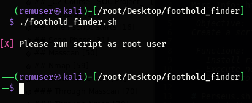

If root, proceed to welcome and target input screen:
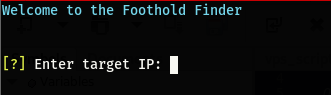

## Scan Phase

Run nmap -sCV scan on target
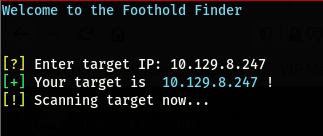

Show open ports, services running, and versions. Also run host scripts to detect OS and Computer/Domain names.
Additionally, if FTP, SMB, SQL, or HTTP servers are running, they will be highlighted below the table.

Examples below are from HtB's Fawn, Dancing, and Archetype machines.
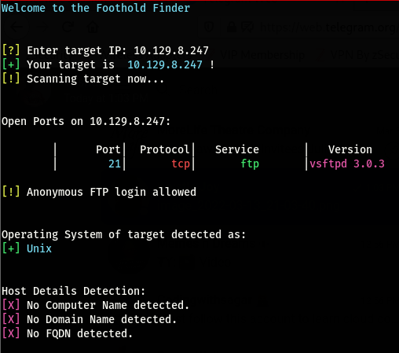
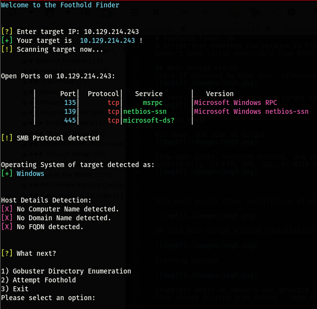
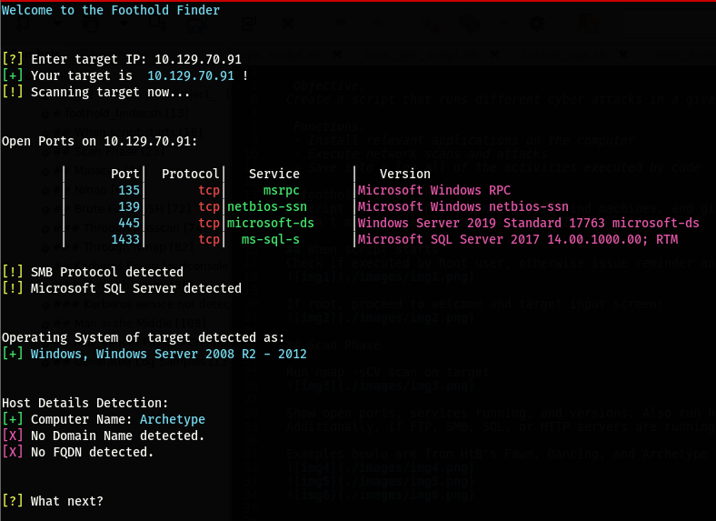


HTTP server online. Choosing Gobuster directory enumeration. The script is set to use the small wordlist and to search for php,xml,html,json,txt,css filetypes :

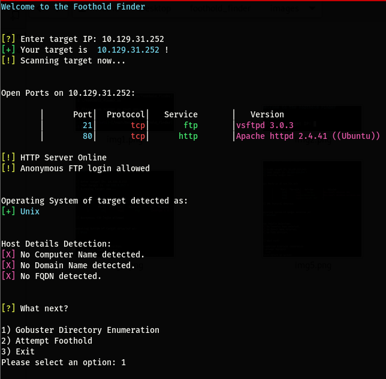
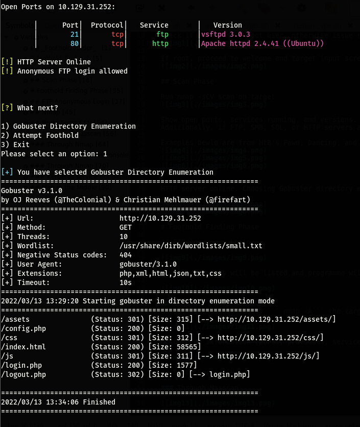

# Foothold Finding Phase

When footholds are attempted:

## FTP Anonymous Login

FTP anonymous login being allowed is detected.
Choose option "Attempte Foothold", then choose FTP Anonymous Login. User needs to input username as anonymous and connect:
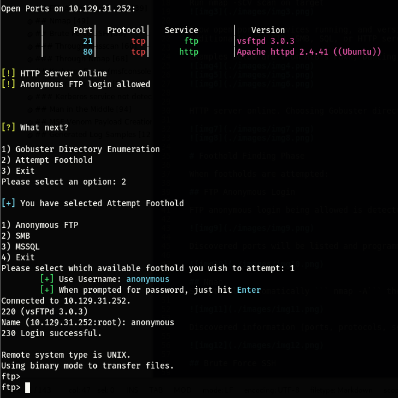

Anonymous connection is successful. Files are accessible and can be downloaded to local machine using ```get``` command:

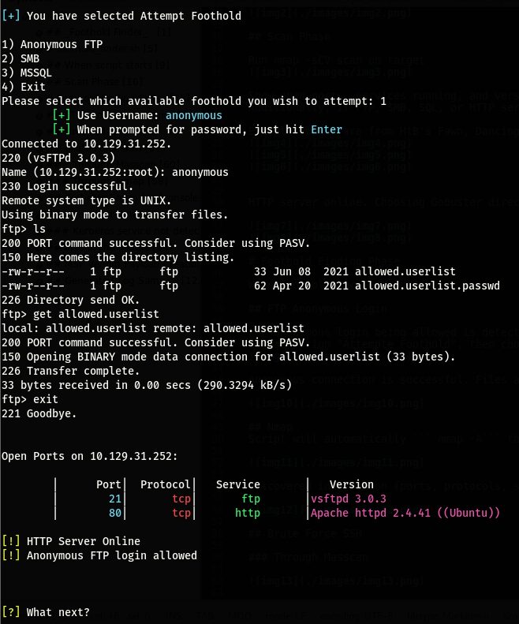

## SMB

SMB server is online. Choose SMB from list - available SMB shares will be listed and user can choose if they want to connect to available shares.

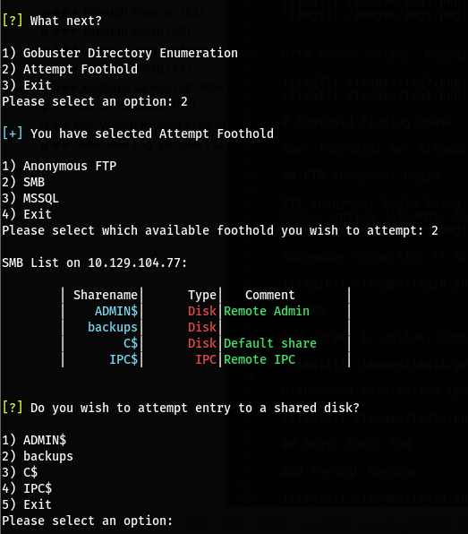

Successful connection. Files are accessible and can be downloaded to local machine using ```get``` command (similar to FTP):

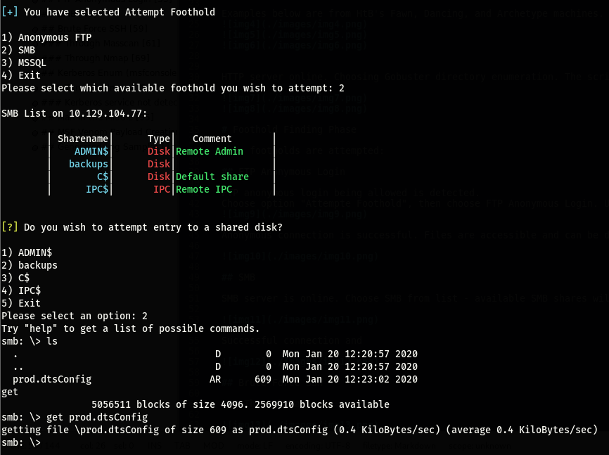

## SQL Database Entry

Using username and password found through other methods, attempt entry (via impacket mssqlclient).
Successful connection into SQL database. Username and Password obfuscated so as not to spoil the fun for people who haven't done those machines yet.

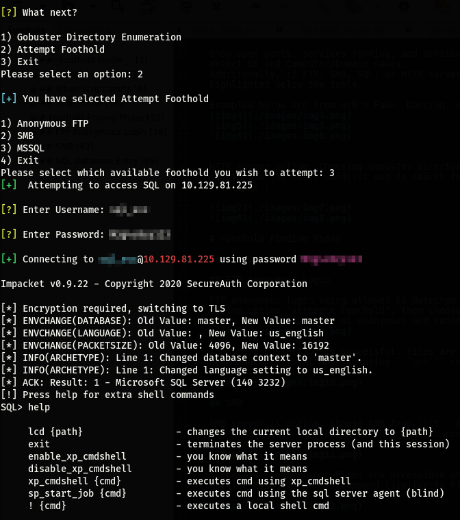

